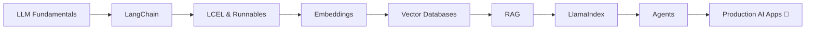

<div align="center">

# 👋 Hey, I'm Aniket Suryavanshi

### Full-Stack Developer | Python Backend | GenAI Engineering


<br/>

<a href="https://www.linkedin.com/in/aniket-suryavanshi-8aab85235">
  
</a>
<a href="https://github.com/AniketS2304">
  
</a>
<a href="https://leetcode.com/u/aniket_suryavanshi2304">
  
</a>

</div>

---

## 🧑‍💻 About Me

```python
class Aniket:
    def __init__(self):
        self.role = "Full-Stack Developer"
        self.focus = ["Backend Engineering", "GenAI Engineering"]
        self.languages = ["Python", "JavaScript", "Java", "SQL"]

        self.backend = ["FastAPI", "Django", "Node.js"]
        self.frontend = ["React", "Tailwind CSS"]
        self.databases = ["PostgreSQL", "MySQL", "MongoDB"]

        self.ai = ["LangChain", "RAG", "LlamaIndex", "pgVector"]
        self.devops = ["Docker", "Nginx", "Linux"]

    def currently_building(self):
        return "Production-ready Full-Stack + AI Applications 🚀"
```

* 🎓 Final-year **B.E. Information Technology** student at SPPU
* 💻 Building with **FastAPI, Django, React & PostgreSQL**
* 🏗️ Contributing to a production **multi-tenant SaaS platform**
* 🤖 Exploring **LangChain, RAG, LlamaIndex, pgVector & Agentic AI**
* 🐳 Working with **Docker, Nginx & Linux**
* 🧠 Strong foundation in **DSA, OOP, DBMS & REST API design**
* 🎯 Goal → Build scalable **AI-powered software products**

---

# ⚡ Tech Arsenal

<div align="center">

### 👨‍💻 Languages


### ⚙️ Backend


### 🎨 Frontend


### 🗄️ Databases


### 🛠️ DevOps & Tools


</div>

### 🤖 AI / GenAI

<div align="center">


</div>

---

# 💼 Experience

## 🧑‍💻 Software Engineer Intern

### LM Software Solutions · Apr 2026 – Present

> Building and shipping features for a production **payroll & attendance SaaS platform**.

```text
⚡ FastAPI        → REST APIs & Business Logic
🐘 PostgreSQL     → Queries, Data Recovery & Schema Work
⚛️ React          → Dashboards & Application UI
🐳 Docker         → Containerized Development
🔀 Git/GitHub     → PR-Based Production Workflow
```

### 🔥 Highlights

* 🚀 Shipped **35+ merged pull requests**
* 🏢 Contributing across **4+ client deployments**
* 🏠 Built end-to-end **WFH workflows**
* 📅 Developed calendar-based **holiday management**
* 📊 Built bulk **Excel/CSV import pipelines**
* 🗄️ Created PostgreSQL recovery utilities across multiple databases
* 🧮 Resolved payroll and attendance calculation edge cases
* 🔐 Contributed to security & scalability reviews

---

## 💻 Full Stack Web Developer Intern

### Scaleful Technologies · Dec 2024 – Jan 2025

* ⚡ Designed and integrated **5+ REST APIs**
* 🔐 Implemented **JWT authentication**
* 🗄️ Built MongoDB-backed CRUD workflows
* ⚛️ Worked with the **MERN stack**
* 🔀 Used Git-based collaborative development workflows

---

# 🚀 Featured Projects

<table>
<tr>
<td width="50%" valign="top">

### 🌾 AgriWise

**Smart Farmland Finder & Advisor**

`Django` `React` `PostgreSQL` `AI`

AI-assisted platform for farmland discovery and agricultural decision support.

**Features**

* 🗺️ Map-based land discovery
* 🌱 Crop recommendations
* 💰 ROI estimation
* 📊 Farmland comparison
* 🌧️ Multi-factor agricultural analysis

</td>

<td width="50%" valign="top">

### 🌦️ Weather App

**Real-Time Weather Platform**

`Python` `Django` `REST API` `Gunicorn`

Production-deployed weather application using external APIs.

**Features**

* 🌎 Real-time weather search
* 🔑 Secure environment configuration
* ⚠️ Structured error handling
* 🚀 Production deployment

</td>
</tr>

<tr>
<td width="50%" valign="top">

### 🤖 JARVIS

**Python Voice Assistant**

`Python` `Speech Recognition` `APIs`

Voice-controlled automation assistant.

**Features**

* 🎙️ Speech recognition
* ⚡ 15+ automation commands
* 🌐 Third-party APIs
* 🖥️ System automation

</td>

<td width="50%" valign="top">

### 📋 Task Manager

**Full-Stack MERN Application**

`React` `Node.js` `Express` `MongoDB`

Full-stack productivity application.

**Features**

* 🔐 Authentication
* 📝 CRUD operations
* 🏷️ Task categories
* 📊 Status tracking

</td>
</tr>
</table>

---

# 🤖 GenAI Journey



### 📚 Currently Exploring

```text
🤖 LangChain
 ├── LCEL
 ├── Runnables
 ├── Structured Outputs
 └── LLM Workflows

🔎 RAG
 ├── Embeddings
 ├── Vector Stores
 ├── Retrieval
 └── pgVector

🧠 LlamaIndex
 ├── Data Connectors
 ├── Document Parsing
 ├── Node Parsing
 ├── VectorStoreIndex
 └── Query Engines

⚡ Next
 ├── Advanced RAG
 ├── Agents
 └── Production GenAI Systems
```

---

# 📊 GitHub Analytics

<div align="center">


</div>

<div align="center">


</div>

---

# 🐍 Contribution Snake

<div align="center">


</div>

---

# 📈 Contribution Activity

<div align="center">


</div>

---

# 🎯 2026 Focus

```text
                ANIKET.exe

       ┌───────────────────────┐
       │   Backend Engineering │
       │ FastAPI • Django • SQL│
       └───────────┬───────────┘
                   │
                   ▼
       ┌───────────────────────┐
       │   Full-Stack Systems  │
       │ React • APIs • Docker │
       └───────────┬───────────┘
                   │
                   ▼
       ┌───────────────────────┐
       │     GenAI Systems     │
       │ LangChain • RAG • LLM│
       └───────────┬───────────┘
                   │
                   ▼
            🚀 AI ENGINEERING
```

---

# 🤝 Let's Connect

<div align="center">

### I'm interested in Full-Stack, Backend & GenAI opportunities 🚀

<a href="https://www.linkedin.com/in/aniket-suryavanshi-8aab85235">

</a>

<a href="https://github.com/AniketS2304">

</a>

<a href="https://leetcode.com/u/aniket_suryavanshi2304">

</a>

<br/><br/>

### ⚡ Code. Build. Ship. Learn. Repeat.


</div>
