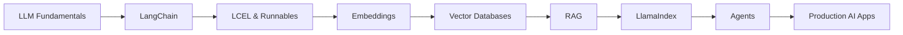

# Aniket Suryavanshi

### Full-Stack Developer · Python Backend · GenAI Engineering

 

  

---

## About Me

I'm a final-year B.E. Information Technology student (SPPU) currently working as a Software Engineer Intern at LM Software Solutions, where I contribute to a production multi-tenant payroll and attendance SaaS platform used across multiple client deployments.

My core focus is backend engineering with Python (FastAPI, Django), full-stack delivery with React and PostgreSQL, and I'm actively building out GenAI skills — LangChain, RAG, LlamaIndex, and vector search with pgVector.

- Building with FastAPI, Django, React & PostgreSQL
- Contributing to a production multi-tenant SaaS platform
- Exploring LangChain, RAG, LlamaIndex & Agentic AI
- Comfortable with Docker, Nginx & Linux environments
- Strong foundation in DSA, OOP, DBMS & REST API design
- Goal: build scalable, AI-powered software products

---

## Tech Stack

**Languages**
 

**Backend**
 

**Frontend**
 

**Databases**
 

**DevOps & Tools**
 

**AI / GenAI**
 

---

## Experience

### Software Engineer Intern — LM Software Solutions
**Apr 2026 – Present**

Building and shipping features for a production payroll and attendance SaaS platform.

- Shipped 35+ merged pull requests across the platform
- Contributed to feature work across 4+ client deployments
- Built end-to-end WFH (work-from-home) workflows
- Developed calendar-based holiday management module
- Built bulk Excel/CSV import pipelines for employee data
- Created PostgreSQL recovery utilities across multiple databases
- Resolved payroll and attendance calculation edge cases
- Contributed to security and scalability reviews

**Stack:** FastAPI · PostgreSQL · React · Docker · Git/GitHub (PR-based workflow)

### Full Stack Web Developer Intern — Scaleful Technologies
**Dec 2024 – Jan 2025**

- Designed and integrated 5+ REST APIs
- Implemented JWT authentication
- Built MongoDB-backed CRUD workflows
- Worked across the MERN stack
- Used Git-based collaborative development workflows

---

## Featured Projects

<table>
<tr>
<td width="50%" valign="top">

### AgriWise
**Smart Farmland Finder & Advisor**

`Django` `React` `PostgreSQL` `AI`

AI-assisted platform for farmland discovery and agricultural decision support.

- Map-based land discovery
- Crop recommendations
- ROI estimation
- Farmland comparison
- Multi-factor agricultural analysis

</td>
<td width="50%" valign="top">

### Weather App
**Real-Time Weather Platform**

`Python` `Django` `REST API` `Gunicorn`

Production-deployed weather application using external APIs.

- Real-time weather search
- Secure environment configuration
- Structured error handling
- Production deployment

</td>
</tr>
<tr>
<td width="50%" valign="top">

### JARVIS
**Python Voice Assistant**

`Python` `Speech Recognition` `APIs`

Voice-controlled automation assistant.

- Speech recognition
- 15+ automation commands
- Third-party API integrations
- System automation

</td>
<td width="50%" valign="top">

### Task Manager
**Full-Stack MERN Application**

`React` `Node.js` `Express` `MongoDB`

Full-stack productivity application.

- Authentication
- CRUD operations
- Task categories
- Status tracking

</td>
</tr>
</table>

---

## GenAI Learning Path

**Currently exploring:** LangChain (LCEL, Runnables, structured outputs), RAG (embeddings, vector stores, retrieval, pgVector), and LlamaIndex (data connectors, document/node parsing, query engines).

**Next up:** advanced RAG architectures, AI agents, and production GenAI systems.

---

## GitHub Analytics

---

## Let's Connect

Open to Full-Stack, Backend, and GenAI opportunities.

